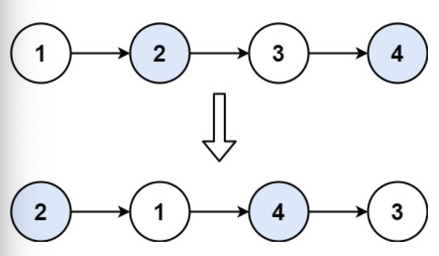

# 24. Swap Nodes in Pairs

-- --
Given a linked list, swap every two adjacent nodes and return its head. You must solve the problem without
modifying the values in the list's nodes (i.e., only nodes themselves may be changed.)

### Example 1:

> **Input** : head = [1,2,3,4]
>
> **Output** : [2,1,4,3]

### Example 2:

> **Input** : head = []
>
> **Output** : []

### Example 3:

> **Input** : head = [1]
>
> **Output** : [1]

### Constraints:

* The number of nodes in the list is in the range `[0, 100]`.
* `0 <= Node.val <= 100`

-- --
Source : [leetcode - 24. Swap Nodes in Pairs](https://leetcode.com/problems/swap-nodes-in-pairs/)

-- --

### Solution

기본적인 Swap 방식을 사용한다

tmp = head.next
head.next = swap(head.next.next)
tmp.next = head

