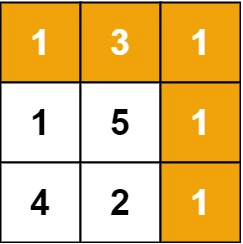

# 64. Minimum Path Sum

-- --
Given a `m x n` `grid` filled with non-negative numbers, find a path from top left to bottom right, which
minimizes the sum of all numbers along its path.

**Note**: You can only move either down or right at any point in time.

### Example 1:

> **Input** : grid = [[1,3,1],[1,5,1],[4,2,1]]
>
> **Output** : 7
>
> **Explanation** : Because the path 1 → 3 → 1 → 1 → 1 minimizes the sum.

### Example 2:

> **Input** : grid = [[1,2,3],[4,5,6]]
>
> **Output** : 12
>

### Constraints:

* `m == grid.length`
* `n == grid[i].length`
* `1 <= m, n <= 200`
* `0 <= grid[i][j] <= 100`

-- --
Source : [leetcode - 64. Minimum Path Sum](https://leetcode.com/problems/minimum-path-sum/)

-- --

### Solution

소거법을 사용한다
0,0 ~ max,max 까지 오른쪽 대각선으로 향한다
세로가 0 일때는 이전 가로 값을 더해준다 
가로가 0 일때는 이전 세로 값을 더해준다
가로 세로가 둘다 0이 아닐때는 현재 값 + Math.min(이전세로값, 이전가로값) 으로 현재 값 + 이전 최소 값을 구한다
결국 마지막 값도 이전 가로 값(최소값만 골라서 sum한 것) 과 이전 세로 값(최소값만 골라서 sum한 것) 둘 중 작은 값을 현재 값에 더할 것이고
결국 그 값이 정답이 될 것이다.
더하면서 이전 값은 고민하지 않는다
