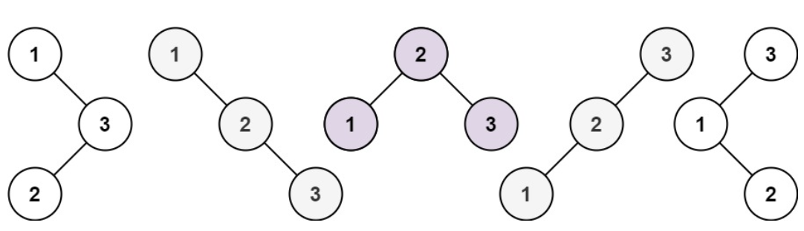

# 96. Unique Binary Search Trees

-- --
Given an integer `n`, return the number of structurally unique **BST**'s (binary search trees) which has exactly n nodes of unique values from `1` to `n`.

### Example 1:

> **Input** : n = 3
>
> **Output** : 5

### Example 2:

> **Input** : n = 1
>
> **Output** : 1
>

### Constraints:

* `n <= 19`

-- --
Source : [leetcode - 96. Unique Binary Search Trees](https://leetcode.com/problems/unique-binary-search-trees/)

-- --

### Solution
