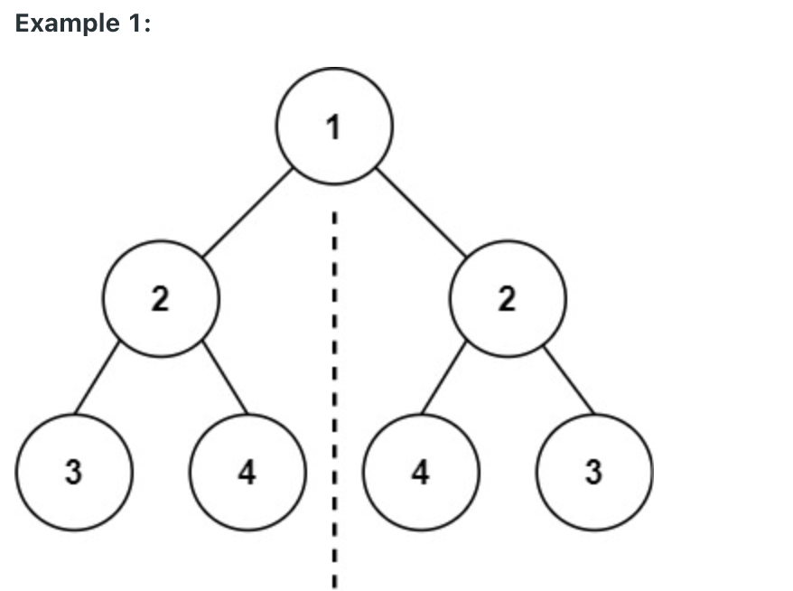

# 101. Symmetric Tree

-- --
Given the `root` of a binary tree, check whether it is a mirror of itself (i.e., symmetric around its center).

### Example 1:
> **Input** : root = [1,2,2,3,4,4,3]
> 
> **Output** : true

### Example 2:
> **Input** : root = [1,2,2,null,3,null,3]
>
> **Output** : false

###Constraints:
* The number of nodes in both trees is in the range `[0, 1000].`
* `-100 <= Node.val <= 100`

-- --
Source : [leetcode - 101. Symmetric Tree](https://leetcode.com/problems/symmetric-tree/)

-- --
## Submit Result

### Runtime:
1 ms, **faster than 56.94%** of Java online submissions for Symmetric Tree.

### Memory Usage:
41.8 MB, **less than 75.40%** of Java online submissions for Symmetric Tree.