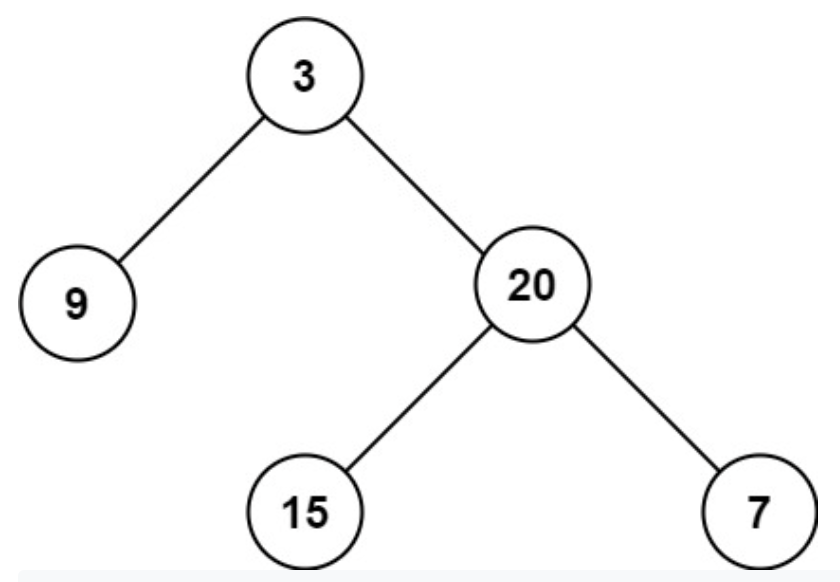

# 104. Maximum Depth of Binary Tree

-- --
Given the `root` of a binary tree, return its maximum depth.

A binary tree's **maximum depth** is the number of nodes along the longest path from the root node down to the farthest leaf node.

### Example 1:
> **Input** : root = [3,9,20,null,null,15,7]
> 
> **Output** : 3

### Example 2:
> **Input** : root = [1,null,2]
>
> **Output** : 2

###Constraints:
* The number of nodes in both trees is in the range `[0, 10^4].`
* `-100 <= Node.val <= 100`

-- --
Source : [leetcode - 104. Maximum Depth of Binary Tree](https://leetcode.com/problems/maximum-depth-of-binary-tree/)

-- --
## Submit Result

### Runtime:
0 ms, **faster than 100.00%** of Java online submissions for Maximum Depth of Binary Tree.

### Memory Usage:
43.5 MB, **less than 26.32%** of Java online submissions for Maximum Depth of Binary Tree.