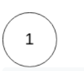

# 141. Linked List Cycle

-- --
Given `head`, the head of a linked list, determine if the linked list has a cycle in it.

There is a cycle in a linked list if there is some node in the list that can be reached again by continuously following the `next` pointer. Internally, pos is used to denote the index of the node that tail's `next` pointer is connected to. Note that pos is not passed as a parameter.

Return `true` `if there is a cycle in the linked list.` Otherwise, return `false`.

### Example 1:

> **Input** : head = [3,2,0,-4], pos = 1
>
> **Output** : true

### Example 2:

> **Input** : head = [1,2], pos = 0
>
> **Output** : true

> ### Example 3:

> **Input** : head = [1], pos = -1
>
> **Output** : false

### Constraints:

* The number of the nodes in the list is in the range `[0, 104]`.
* `-105 <= Node.val <= 105`
* `pos` is `-1` or a **valid index** in the linked-list.

**Follow up**: Can you solve it using `O(1)` (i.e. constant) memory?

-- --
Source : [141. Linked List Cycle
](https://leetcode.com/problems/linked-list-cycle/)

-- --

## Submit Result

### Runtime:

### Memory Usage: