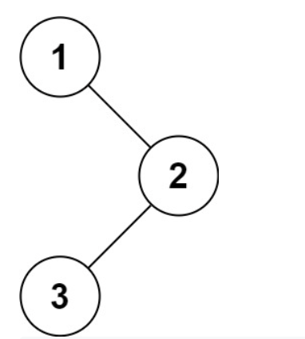

# 144. Binary Tree Preorder Traversal

-- --
Given the `root` of a binary tree, return the preorder traversal of its nodes' values.

### Example 1:

> **Input** : root = [1,null,2,3]
>
> **Output** : [1,2,3]

### Example 2:

> **Input** : root = []
>
> **Output** : []

### Example 3:

> **Input** : root = [1]
>
> **Output** : [1]

### Constraints:

* The number of nodes in the tree is in the range `[0, 100]`.
* `-100 <= Node.val <= 100`

**Follow up**: Recursive solution is trivial, could you do it iteratively?
-- --
Source : [144. Binary Tree Preorder Traversal](https://leetcode.com/problems/binary-tree-preorder-traversal/)
-- --

## Submit Result

### Runtime: 
0 ms, **faster than 100.00%** of Java online submissions for Binary Tree Preorder Traversal.

### Memory Usage: 
42 MB, **less than 64.76%** of Java online submissions for Binary Tree Preorder Traversal.