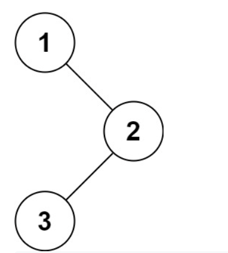

# 145. Binary Tree Postorder Traversal

-- --
Given the `root` of a binary tree, return the postorder traversal of its nodes' values.

### Example 1:

> **Input** : root = [1,null,2,3]
>
> **Output** : [3,2,1]

### Example 2:

> **Input** : root = []
>
> **Output** : []

> ### Example 3:
> **Input** : root = [1]
>
> **Output** : [1]

### Constraints:

* The number of nodes in the tree is in the range `[0, 100]`.
* `-100 <= Node.val <= 100`

**Follow up**: Recursive solution is trivial, could you do it iteratively?
-- --
Source : [145. Binary Tree Postorder Traversal
](https://leetcode.com/problems/binary-tree-postorder-traversal/)
-- --

## Submit Result

### Runtime:
0 ms, **faster than 100.00%** of Java online submissions for Binary Tree Postorder Traversal.

### Memory Usage: 
40.2 MB, **less than 98.38%** of Java online submissions for Binary Tree Postorder Traversal.